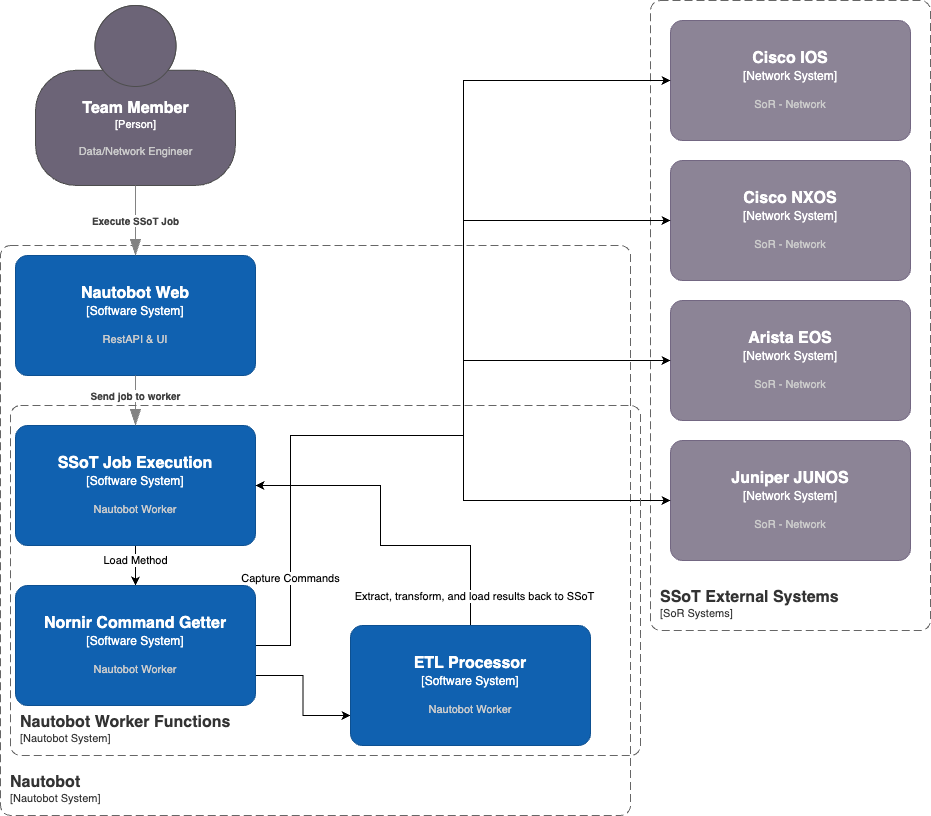

# Network SSoT Detailed Design

This page will describe the newer SSoT jobs that this App exposes and how they work.

## Frameworks in Use

- [Nautobot SSoT](https://docs.nautobot.com/projects/ssot/en/latest/) - Utilzing the existing Nautobot SSoT framework allows a common pattern to be re-used and offers a path forward to add additional support and features.
- [Nautobot App Nornir](https://docs.nautobot.com/projects/plugin-nornir/en/latest/) - Utilized for Nornir Inventory plugins for Nautobot (specifically for Sync Network Data Job).
- [Nornir Netmiko](https://github.com/ktbyers/nornir_netmiko) - Used to execute commands and return results.
- [Jdiff](https://jdiff.readthedocs.io/en/latest/usage/#extract_data_from_json) - Used to simplify parsing required data fields out of command outputs returned from command parser libraries like textFSM. Specifically `extract_data_from_json` method.
- Parsers - Initially NTC Templates via textFSM, but future support for PyATS, TTP, etc. is expected in the future.

## YAML Definition DSL

To learn how to extend the app, or update its default YAML definitions visit [Extending and Overriding Platform YAML Files](./app_yaml_overrides.md).

## How the SSoT **Sync Devices From Network** Job Works

1. The job is executed with inputs selected.
    - List of comma seperated IP/DNS names is provided.
    - Other required fields are selected in the job inputs form.

2. The SSoT framework loads the Nautobot adapter information.
3. The SSoT frameworks network adapater `load()` method calls nornir functionality.
    - The job inputs data is passed to the InitNornir initializer, because we only have basic information a custom `EmptyInventory` Nornir inventory plugin is packaged with the App. This get initialized in the `InitNornir` function, but actually initialzes a true inventory that is empty.
    - Since `Platform` information may need to be auto-detected before adding a Nornir `Host` object to the inventory, a `create_inventory` function is executed that uses the SSH-Autodetect via Netmiko to try to determine the platform so it can be injected into the `Host` object.
    - Finally, all the platform specific commands to run, along with all the jpath, `post_processor` information loaded from the platform specific YAML files must be injected into the Nornir data object to be accessible later in the extract, transform functions.
4. Within the context of a Nornir `with_processor` context manager call the `netmiko_send_commands` Nornir task.
    - Access the loaded platform specific YAML data and deduplicate commands to avoid running the same command multiple times. E.g. Multiple required data attributes come from the same show command.
5. Utilize native Nornir Processor to overload functionality on `task_instance_completed()` to run command outputs through extract and transformation functions.
    - This essentially is our "ET" portion of a "ETL" process.
    - Next, the JSON result from the show command after the parser executes (E.g. textfsm), gets run through the jdiff function `extract_data_from_json()` with the data and the `jpath` from the YAML file definition.
    - Finally, an optional `post_processor` jinja2 capable execution can further transform the data for that command before passing it to finish the SSoT syncronizaton.

## How the SSoT **Sync Network Data From Network** Job Works

1. The job is executed with inputs selected.
    - One or multiple device selection.
    - Other required fields are selected in the job inputs form.
    - Toggle certain metadata booleans to True if you want more data synced.

2. The SSoT framework loads the Nautobot adapter information.
3. The SSoT frameworks network adapater `load()` method calls Nornir functionality.
    - The job inputs data is passed to the InitNornir initializer, because devices now exist in Nautobot we use `NautobotORMInventory` Nornir inventory plugin comes from `nautobot-plugin-nornir`.
    - Finally, all the platform specific `commands` to run, along with all the `jpath`, `post_processor` information loaded from the platform specific YAML files must be injected into the Nornir data object to be accessible later in the extract, transform functions.
4. Within the context of a Nornir `with_processor` context manager call the `netmiko_send_commands` Nornir task.
    - Access the loaded platform specific YAML data and deduplicate commands to avoid running the same command multiple times. E.g. Multiple required data attributes come from the same show command.
5. Utilize native Nornir Processor to overload functionality on `subtask_instance_completed()` to run command outputs through extract and transformation functions.
    - This essentially is our "ET" portion of a "ETL" process.
    - Next, the JSON result from the show command after the parser executes (E.g. textfsm), gets run through the jdiff function `extract_data_from_json()` with the data and the `jpath` from the YAML file definition.
    - Finally, an optional `post_processor` jinja2 capable execution can further transform the data for that command before passing it to finish the SSoT syncronizaton.

## Detailed Design Diagram

Here are three diagrams detailing the SSoT based jobs in deeper detail.

.
.
.
